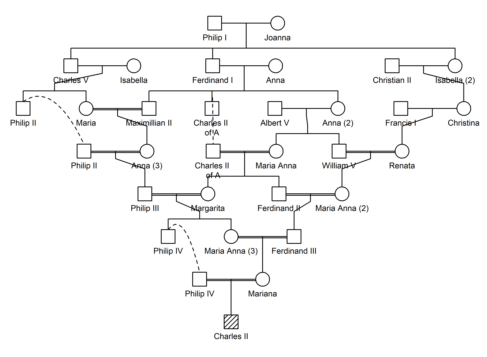

<!-- README.md is generated from README.Rmd. Please edit that file -->

# verbalisr

<!-- badges: start -->

[](https://CRAN.R-project.org/package=verbalisr)
[](https://cran.r-project.org/package=verbalisr)
[](https://cran.r-project.org/package=verbalisr)
<!-- badges: end -->

The purpose of **verbalisr** is to describe pedigree relationships in
plain language. This is often helpful in order to understand complex
genealogies. Given two members of any pedigree, **verbalisr** spells out
the connecting paths between them, using common terminology like
*great-grandmother* and *half first cousins*.

To see **verbalisr** in action, check out the interactive app
**QuickPed** for building and analysing pedigrees, available online
here: <https://magnusdv.shinyapps.io/quickped>.

The **verbalisr** package is part of the [ped
suite](https://magnusdv.github.io/pedsuite/) framework for pedigree
analysis in R.

## Installation

To get the current official version of **verbalisr**, install from CRAN
as follows:

``` r
install.packages("verbalisr")
```

Alternatively, the development version can be installed from GitHub
with:

``` r
# install.packages("devtools")
devtools::install_github("magnusdv/verbalisr")
```

## Example

``` r
library(verbalisr)
#> Loading required package: pedtools
```

Here is an example involving a double-cousin-like relationship:

``` r
x = doubleCousins(degree1 = 1, removal1 = 1, half1 = TRUE,  # half first cousins once removed
                  degree2 = 2, removal2 = 0)                # second cousins

plot(x, hatched = 16:17)
```


We apply `verbalise()` to describe the relationship between the
children:

``` r
verbalise(x, ids = 16:17)
#> Half first cousins once removed
#>    16-10-[4]-12-15-17
#> Second cousins
#>    16-13-6-[1,2]-8-14-17
```

This output shows that 16 and 17 are simultaneous first cousins once
removed and second cousins. Below each description follows the
corresponding path, with its oldest shared ancestor(s) indicated in
brackets. Paths with two ancestors on top contribute *full*
relationships, otherwise the contribution is a *half* relationship.

## A bigger example: The royal Habsburg family

The figure below shows a subset of the (infamously inbred) royal
Habsburg family, contained in the built-in dataset `habsburg`.
Untangling all the loops in this pedigree *by hand* would be a daunting
task, making it a good test case for **verbalisr**.

``` r
plot(habsburg, hatched = "Charles II", cex = 0.6, margin = c(1, 1, .1, 1))
```



The inbreeding coefficient of King Charles II of Spain (the bottom
individual) was close to 25%, i.e., similar to a child produced by
brother-sister incest. We can check this with the help of **ribd**:

``` r
ribd::inbreeding(habsburg, "Charles II")
#> [1] 0.230957
```

The high inbreeding coefficient shows that the parents of Charles II
were closely related. But *how* were they related? **verbalisr** gives
the answer:

``` r
verbalise(habsburg, ids = c("Philip IV", "Mariana"))
#> Avuncular: Philip IV is an uncle of Mariana
#>    Philip IV-[Philip III,Margarita]-Maria Anna (3)-Mariana
#> First cousins once removed
#>    Philip IV-Margarita-[Charles II of A,Maria Anna]-Ferdinand II-Ferdinand III-Mariana
#> Second cousins once removed
#>    Philip IV-Margarita-Maria Anna-[Albert V,Anna (2)]-William V-Maria Anna (2)-Ferdinand III-Mariana
#> Triple second cousins twice removed
#>    Philip IV-Margarita-Charles II of A-[Ferdinand I,Anna]-Maximillian II-Anna (3)-Philip III-Maria Anna (3)-Mariana
#>    Philip IV-Margarita-Charles II of A-[Ferdinand I,Anna]-Anna (2)-Maria Anna-Ferdinand II-Ferdinand III-Mariana
#>    Philip IV-Margarita-Charles II of A-[Ferdinand I,Anna]-Anna (2)-William V-Maria Anna (2)-Ferdinand III-Mariana
#> Triple third cousins
#>    Philip IV-Philip III-Anna (3)-Maximillian II-[Ferdinand I,Anna]-Charles II of A-Margarita-Maria Anna (3)-Mariana
#>    Philip IV-Philip III-Anna (3)-Maximillian II-[Ferdinand I,Anna]-Charles II of A-Ferdinand II-Ferdinand III-Mariana
#>    Philip IV-Margarita-Maria Anna-Anna (2)-[Ferdinand I,Anna]-Charles II of A-Ferdinand II-Ferdinand III-Mariana
#> Septuple third cousins once removed
#>    Philip IV-Philip III-Philip II-Charles V-[Philip I,Joanna]-Ferdinand I-Charles II of A-Margarita-Maria Anna (3)-Mariana
#>    Philip IV-Philip III-Philip II-Charles V-[Philip I,Joanna]-Ferdinand I-Charles II of A-Ferdinand II-Ferdinand III-Mariana
#>    Philip IV-Margarita-Charles II of A-Ferdinand I-[Philip I,Joanna]-Charles V-Philip II-Philip III-Maria Anna (3)-Mariana
#>    Philip IV-Philip III-Anna (3)-Maximillian II-[Ferdinand I,Anna]-Anna (2)-Maria Anna-Margarita-Maria Anna (3)-Mariana
#>    Philip IV-Philip III-Anna (3)-Maximillian II-[Ferdinand I,Anna]-Anna (2)-Maria Anna-Ferdinand II-Ferdinand III-Mariana
#>    Philip IV-Philip III-Anna (3)-Maximillian II-[Ferdinand I,Anna]-Anna (2)-William V-Maria Anna (2)-Ferdinand III-Mariana
#>    Philip IV-Margarita-Maria Anna-Anna (2)-[Ferdinand I,Anna]-Maximillian II-Anna (3)-Philip III-Maria Anna (3)-Mariana
#> Sextuple third cousins twice removed
#>    Philip IV-Philip III-Philip II-Charles V-[Philip I,Joanna]-Ferdinand I-Anna (2)-Maria Anna-Margarita-Maria Anna (3)-Mariana
#>    Philip IV-Philip III-Philip II-Charles V-[Philip I,Joanna]-Ferdinand I-Anna (2)-Maria Anna-Ferdinand II-Ferdinand III-Mariana
#>    Philip IV-Philip III-Philip II-Charles V-[Philip I,Joanna]-Ferdinand I-Anna (2)-William V-Maria Anna (2)-Ferdinand III-Mariana
#>    Philip IV-Philip III-Philip II-Charles V-[Philip I,Joanna]-Isabella (2)-Christina-Renata-Maria Anna (2)-Ferdinand III-Mariana
#>    Philip IV-Margarita-Charles II of A-Ferdinand I-[Philip I,Joanna]-Charles V-Maria-Anna (3)-Philip III-Maria Anna (3)-Mariana
#>    Philip IV-Margarita-Charles II of A-Ferdinand I-[Philip I,Joanna]-Isabella (2)-Christina-Renata-Maria Anna (2)-Ferdinand III-Mariana
#> Triple 4'th cousins
#>    Philip IV-Philip III-Anna (3)-Maria-Charles V-[Philip I,Joanna]-Ferdinand I-Charles II of A-Margarita-Maria Anna (3)-Mariana
#>    Philip IV-Philip III-Anna (3)-Maria-Charles V-[Philip I,Joanna]-Ferdinand I-Charles II of A-Ferdinand II-Ferdinand III-Mariana
#>    Philip IV-Margarita-Maria Anna-Anna (2)-Ferdinand I-[Philip I,Joanna]-Charles V-Philip II-Philip III-Maria Anna (3)-Mariana
#> Septuple 4'th cousins once removed
#>    Philip IV-Philip III-Anna (3)-Maria-Charles V-[Philip I,Joanna]-Ferdinand I-Anna (2)-Maria Anna-Margarita-Maria Anna (3)-Mariana
#>    Philip IV-Philip III-Anna (3)-Maria-Charles V-[Philip I,Joanna]-Ferdinand I-Anna (2)-Maria Anna-Ferdinand II-Ferdinand III-Mariana
#>    Philip IV-Philip III-Anna (3)-Maria-Charles V-[Philip I,Joanna]-Ferdinand I-Anna (2)-William V-Maria Anna (2)-Ferdinand III-Mariana
#>    Philip IV-Philip III-Anna (3)-Maria-Charles V-[Philip I,Joanna]-Isabella (2)-Christina-Renata-Maria Anna (2)-Ferdinand III-Mariana
#>    Philip IV-Philip III-Anna (3)-Maximillian II-Ferdinand I-[Philip I,Joanna]-Isabella (2)-Christina-Renata-Maria Anna (2)-Ferdinand III-Mariana
#>    Philip IV-Margarita-Maria Anna-Anna (2)-Ferdinand I-[Philip I,Joanna]-Charles V-Maria-Anna (3)-Philip III-Maria Anna (3)-Mariana
#>    Philip IV-Margarita-Maria Anna-Anna (2)-Ferdinand I-[Philip I,Joanna]-Isabella (2)-Christina-Renata-Maria Anna (2)-Ferdinand III-Mariana
```
