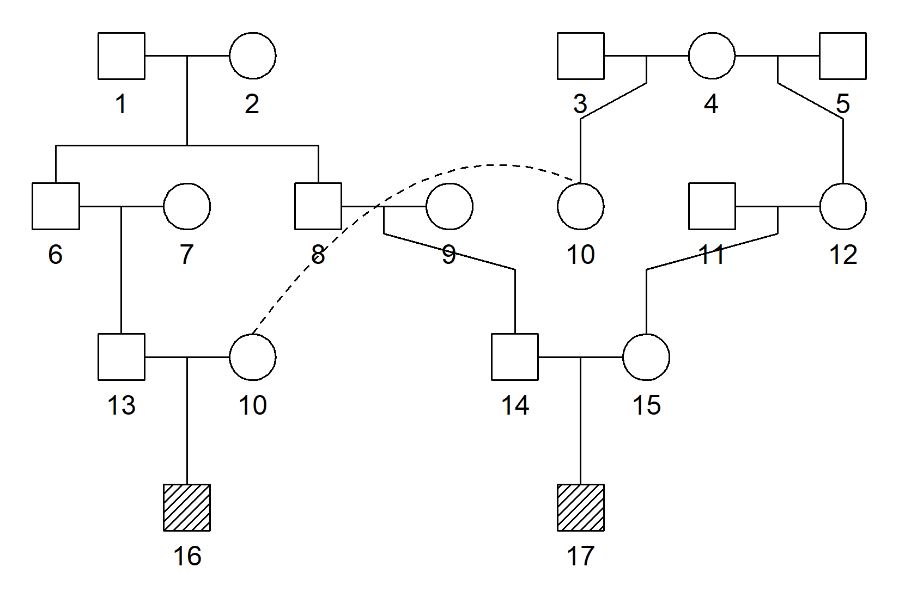

<!-- README.md is generated from README.Rmd. Please edit that file -->

# verbalisr

<!-- badges: start -->

[](https://CRAN.R-project.org/package=verbalisr)
<!-- badges: end -->

The purpose of **verbalisr** is to describe pedigree relationships in
plain language. This is often helpful in order to understand complex
genealogies. Given two members of any pedigree, **verbalisr** spells out
the connecting paths between them, using common terminology like
*great-grandmother* and *half first cousins*.

**verbalisr** is part of the [ped
suite](https://magnusdv.github.io/pedsuite/) framework for pedigree
analysis in R. A good place to experiment with **verbalisr** is the
online app **QuickPed** for building and analysing pedigrees. Try
QuickPed here: <https://magnusdv.shinyapps.io/quickped>.

## Installation

The development version of **verbalisr** can be installed from GitHub
with:

``` r
# install.packages("devtools")
devtools::install_github("magnusdv/verbalisr")
```

## Example

``` r
library(verbalisr)
#> Loading required package: pedtools
```

Here is an example involving a double-cousin-like relationship:

``` r
x = doubleCousins(degree1 = 1, removal1 = 1, half1 = TRUE,  # half first cousins once removed
                  degree2 = 2, removal2 = 0)                # second cousins

plot(x, hatched = 16:17)
```



We apply `verbalise()` to describe the relationship between the
children:

``` r
verbalise(x, ids = 16:17)
#> Half first cousins once removed
#>    16-10-[4]-12-15-17
#> Second cousins
#>    16-13-6-[1,2]-8-14-17
```

This output shows that 16 and 17 are simultaneous first cousins once
removed and second cousins. Below each description follows the
corresponding path, with its oldest shared ancestor(s) indicated in
brackets. Paths with two ancestors on top contribute *full*
relationships, otherwise the contribution is a *half* relationship.
